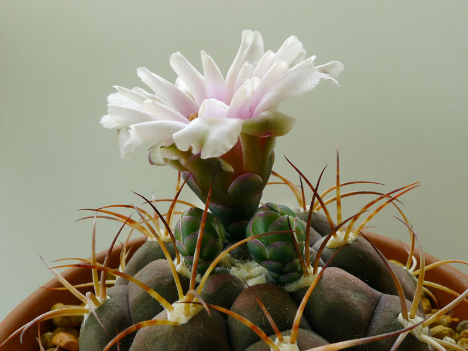

Rich and I bought this lovely *Gymnocalycium pflanzii* five or six years ago. It was a Lowe’s rescue purchase, so I had little hope for him from the start. But he has kept his neatly symmetrical shape while surviving a variety of conditions from chilly and dark in our kitchen to full sun in the warmth of our sunroom. No matter the environment, the only variation I noticed was in the color of his skin, going from dark green when kept in lower light to a rich purple-green in full sun.

<figure>
  
  <figcaption>This view from the side shows the graceful outer covering of the bud, and two emerging buds.</figcaption>
</figure>

This unassuming little cactus has grown slowly and consistently and has worked his way into my heart over the years. But he never flowered, until now. I first thought I noticed buds in early April. I was ecstatic to see a barely-perceptible nub poking through one of the areoles near the center of the plant. I enthusiastically pointed out the bud to Rich (I actually screamed when I first saw it!), even though we had to use a magnifying glass to confirm what it was. A few days later, the original bud was larger and two more tiny nubs were emerging from nearby areoles.

The much-heralded opening of the flower was less than spectacular, due to our less-than-spectacular temperatures and amount of sunshine lately. But by the fourth day, the sunroom temperature climbed to 80° and the cactus gave us a better show. Two more to go!


