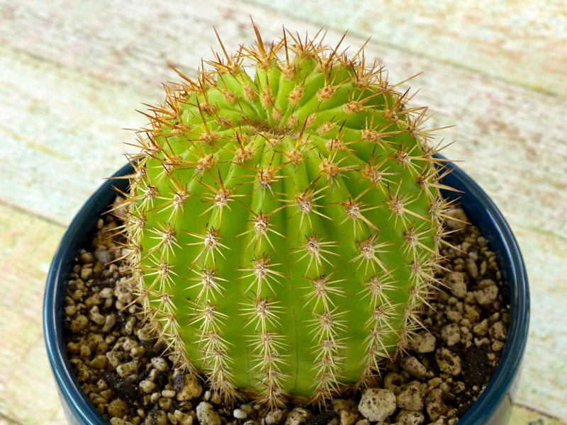

Rich and I noticed this poor cactus at the back of the bottom shelf of a wooden rack in Lowe's garden section. We had to pull out several trays of other cacti just to reach it.  The pale color is probably a result of being in low light for a significant amount of time. At least it wasn't overwatered and doesn't exhibit etiolated growth. 

The plant is labeled "Trichocereus grandiflorus," which I'm pretty sure it's not. (Altman's grows nice plants, but their identifications are often wrong.) It's some type of Echinopsis—perhaps what used to be called Sohrensia—but we don't know which one. 

<figure>
  
  <figcaption><a href="http://www.flickr.com/photos/80901381@N04/7758832526/" title="Poor cactus">Poor cactus</a>.</figcaption>
</figure>
